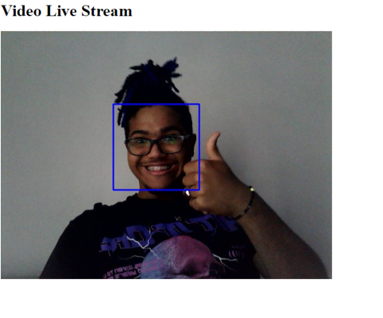

# OpenCV-Django

Integration of the openCv toolkit with the django framework to perform facial recognition with ml (the project isnt done yet, but the core works)

## 🔧 Functions 

### Video live Stream:
- the project is able to perform video streaming with up to 2 cameras (can be ipcams)

### Easy recognition :
- The project is able to identify human faces with mask or without mask 

## Made With:

## 🤝 Contribution

Project open for help!

Remember to follow the license requirements...

## 💰 Donate

### Support Of Contact

Copyright © 2021 Thiago Santos

